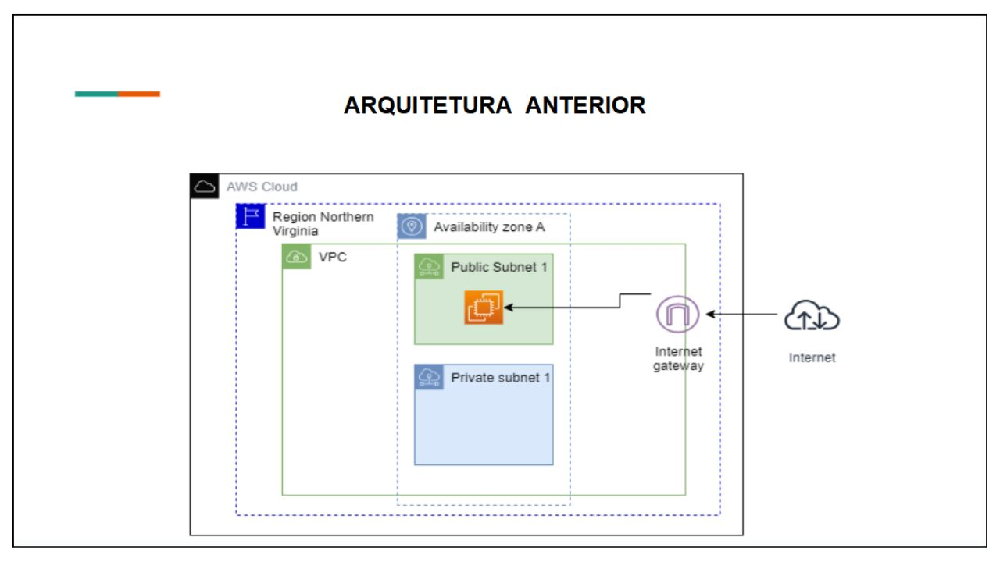
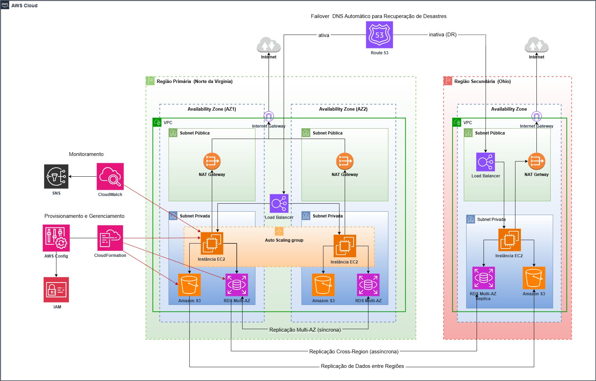

# 📚 TCC - Evolução da Arquitetura de E-commerce com Foco em Confiabilidade e Recuperação de Desastres

Em 2024, finalizei uma etapa importante na Escola da Nuvem com a entrega e apresentação do TCC! O trabalho consistiu em evoluir a arquitetura de um e-commerce com foco em Confiabilidade e Recuperação de Desastres, utilizando as melhores práticas da AWS. 

A arquitetura foi projetada para garantir alta disponibilidade e rápida recuperação em caso de falhas. Aqui estão os principais componentes:

---

## 🔹 Principais Componentes da Arquitetura

### 1. **Arquitetura Anterior**
- Abaixo, temos a arquitetura original do e-commerce antes da evolução com foco em confiabilidade e recuperação de desastres:

  

### 2. **Arquitetura Otimizada**
- Abaixo, temos a arquitetura otimizada após as melhorias para garantir alta disponibilidade e recuperação rápida em caso de falhas:

  

---

## 🔹 Principais Componentes da Arquitetura

### 1. **Zonas de Disponibilidade (AZs)**
- Utilizamos uma Região Primária e uma Secundária para garantir que, se uma falhar, a outra continue funcionando.

### 2. **Rede e Segurança**
- Criamos VPCs e sub-redes para isolar recursos, usando **Security Groups** e **NAT Gateways** para controlar o acesso à Internet.

### 3. **Serviços de Computação (EC2)**
- As instâncias **EC2** são escaláveis automaticamente, distribuindo a carga de trabalho com **Elastic Load Balancer**.

### 4. **Banco de Dados (RDS)**
- Configuramos o **RDS** com **Multi-AZ** e réplicas para assegurar a integridade dos dados.

### 5. **Armazenamento (S3)**
- Utilizamos **S3** com replicação entre regiões para garantir que os dados estejam sempre disponíveis.

### 6. **DNS e Failover (Route 53)**
- O **Route 53** permite redirecionar automaticamente o tráfego para a região ativa em caso de falha.

### 7. **Monitoramento**
- Integração do **Amazon SNS** com **CloudWatch** para alertas em tempo real.

### 8. **Orquestração (AWS CloudFormation)**
- Utilizamos o **CloudFormation** para definir e gerenciar a infraestrutura como código, automatizando a criação, atualização e versionamento dos recursos AWS. Com templates **YAML/JSON**, garantimos uma arquitetura replicável e escalável, facilitando a manutenção e expansão de forma eficiente e segura.

### 9. **Conformidade e Auditoria (AWS Config)**
- Implementamos o **AWS Config** para monitorar e avaliar as configurações dos recursos, garantindo conformidade contínua com as melhores práticas de segurança e auditoria.

---

## 🛠️ Ferramentas e Serviços Utilizados

- **AWS EC2** – Para computação escalável.
- **AWS RDS** – Banco de dados com alta disponibilidade.
- **AWS S3** – Armazenamento seguro e replicado.
- **AWS Route 53** – Gerenciamento de DNS e failover.
- **AWS CloudFormation** – Infraestrutura como código.
- **AWS Config** – Monitoramento e conformidade de recursos.

---

## 🎯 Objetivos do TCC

- Garantir alta disponibilidade da aplicação.
- Assegurar recuperação rápida e eficiente em caso de desastres.
- Automatizar a infraestrutura utilizando práticas recomendadas da AWS.

---

## 💡 Aprendizados

A experiência trouxe um aprendizado valioso sobre como garantir escalabilidade, disponibilidade e recuperação de desastres em ambientes de missão crítica. O uso de ferramentas como o **CloudFormation** e o **AWS Config** garantiu uma arquitetura eficiente, segura e fácil de escalar conforme necessário.

---

Este repositório contém todos os materiais e a documentação relacionados ao TCC desenvolvido, incluindo a arquitetura implementada e os detalhes dos serviços da AWS utilizados.
